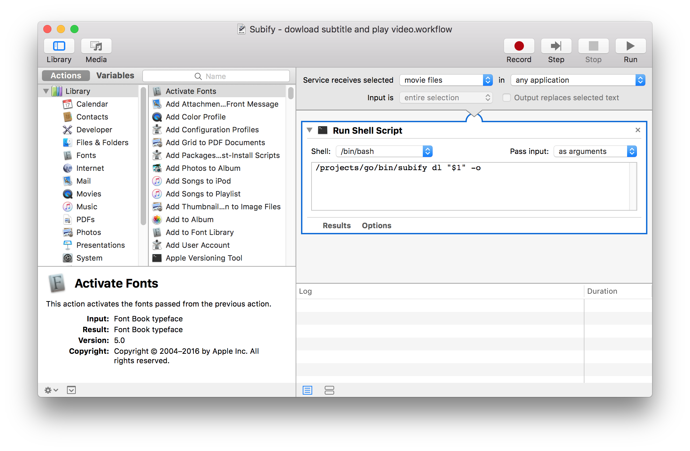

Subify is a tool to download subtitles for your favorite TV shows and movies.
It is directly able to open the video with your default player, once the subtitle is downloaded.

Subify combines [OpenSubtitles API](http://trac.opensubtitles.org/projects/opensubtitles/wiki) and [Addic7ed](http://www.addic7ed.com/) to get the best subtitles for your video. It also considers that you use a default player interpreting srt subtitles when the video file name is the same than the srt file (ex: [VLC](http://www.videolan.org/vlc/)).

Subify gets the best match from several APIs in this order. This default behavior can easily be changed. See the documentation below

1. OpenSubtitles
2. Addic7ed

## Installing

Download the [latest version of Subify](https://github.com/matcornic/subify/releases), and that's it. No need to install something else. Works on Linux, Mac OS (Darwin) and Windows

If you use Golang, you can get Subify and its binary directly with :
```shell
go get -u github.com/matcornic/subify
```

### Mac OS

In MacOS, you can use the power of **Service Automator** to add *Subify* options in the Finder contextual menu for your videos.


* Open Automator
* Create a Service
* On top :
  * Service receives select => *Movie files*
  * In => *Any application*
* Drag & drop a *Run shell script* action
  * Shell => `bin/bash`
  * Pass input => *as argument*
  * Copy the following code in the input :

```shell
# Change "/projects/go/bin/subify" by the path of your downloaded binary
# Use the commaned you want. Commands are explained below
/projects/go/bin/subify dl "$1" -o
```

* Save to service with the name that you want to be displayed in the Finder menu (e.g. *Subify - download subtitle and play video*)
* Enjoy your video with subtitles in one click
* Create as many as service you need (*don't open video*, *change API order*, *change language*, and so on)



### Windows

In Windows, you can use Shortcuts do to approximately the same. 

- Open Run (win + R) and execute `shell:sendto` (this will navigate to the folder with the "Send to" context menu shortcuts)
- Add an new shortcut
- Location: `C:\Windows\System32\cmd.exe /k "C:\tools\subify.exe dl -o"` (Change the subify command if needed)
- Choose an name, like "Subtitle and open"

And you're done! Just right mouse click on an video and Send to > Subtitle and open. It will find the subtitle and open the video.

Issues:

- You have to add the first part to prevent the `You need to open cmd.exe and run it from there.` warning. This makes sense if there is no file parameter, but the Send to functionality in explorer automatically adds this.
- You can not change the icon. (Changing it will replace the CMD shortcut icon everywhere)
- After opening there is still an CMD window open. You can fix this by changing `/k` to `/c`, but then you will never know when an error occurs.

> Thanks @AndreasFurster for finding this tip. 

## Get started
Note : the binary is usable as is. If you want to run the command from anywhere on your OS, make sure to add Subify home installation to your PATH environment variable

```shell
# Download subtitle with default language (English) from default APIs (OpenSubtitles, then Addic7ed)
subify dl <path_to_your_video>
# Download subtitle with default language (English), from default APIs (OpenSubtitles, then Addic7ed), then open video with your default player
subify dl <path_to_your_video> -o
# Download subtitle with french language, from default APIs (OpenSubtitles, then Addic7ed), and open with your default player
subify dl <path_to_your_video> -o -l fr
# Download subtitle with french language, if not found spanish, if not found english, from default APIs (OpenSubtitles, then Addic7ed)
subify dl <path_to_your_video> -l fr,es,en
# Download subtitle with default language, by searching first in Addic7ed then OpenSubtitles
subify dl <path_to_your_video> -a add,os
# Download subtitle with default language, by searching only in OpenSubtitles
subify dl <path_to_your_video> -a OpenSubtitles
```

## Documentation
### Global usage
```
Tool to handle subtitles for your best TV Shows and movies
http://github.com/matcornic/subify

Usage:
  subify [command]

Available Commands:
  dl          Download the subtitles for your video - 'subify dl --help'
  help        Help about any command
  list        List information about something
  version     Get version of Subify

Flags:
      --config string   Config file (default is $HOME/.subify.yaml|json|toml). Edit to change default behavior
      --dev             Instantiate development sandbox instead of production variables
  -h, --help            help for subify
  -v, --verbose         Print more information while executing

Use "subify [command] --help" for more information about a command.
```

### Downloading command
```
Download the subtitles for your video (movie or TV Shows)
Give the path of your video as first parameter and let's go !

Usage:
  subify dl <video-path> [flags]

Aliases:
  dl, download

Flags:
  -a, --apis string        Overwrite default searching APIs behavior, hence the subtitles are downloaded. Available APIs at 'subify list apis' (default "OpenSubtitles,Addic7ed")
  -h, --help               help for dl
      --lang-in-filename   Language is in the filename (e.g. if enabled: 'xxx.English.srt' for English), else 'xxx.srt' (default true)
  -l, --languages string   Languages of the subtitle separated by a comma (First to match is downloaded). Available languages at 'subify list languages' (default "en")
  -n, --notify             Display desktop notification (default true)
  -o, --open               Once the subtitle is downloaded, open the video with your default video player (OSX: "open", Windows: "start", Linux/Other: "xdg-open")

Global Flags:
      --config string   Config file (default is $HOME/.subify.yaml|json|toml). Edit to change default behavior
      --dev             Instantiate development sandbox instead of production variables
  -v, --verbose         Print more information while executing

```

### Listing command

```
List available languages

Usage:
  subify list languages [flags]

Aliases:
  languages, lang


Global Flags:
      --all             Shows all languages
      --config string   Config file (default is $HOME/.subify.|json|yaml|toml). Edit to change default behaviour
      --dev             Instanciate development sandbox instead of production variables
  -v, --verbose         Print more information while executing
```
```
List the available apis used by Subify

Usage:
  subify list apis [flags]

Global Flags:
      --config string   Config file (default is $HOME/.subify.|json|yaml|toml). Edit to change default behaviour
      --dev             Instanciate development sandbox instead of production variables
  -v, --verbose         Print more information while executing
```

## Compile from source

Binaries for common Operating Systems and architectures are available in [Release page](https://github.com/matcornic/subify/releases). But if you need to compile Subify from source, you can do it as well.

1. [Install Go 1.13+](https://golang.org/doc/install) 
2. Download Subify: `git clone https://github.com/matcornic/subify.git` (for HTTPS) or `git@github.com:matcornic/subify.git` (for SSH), or `https://github.com/matcornic/subify/archive/master.zip` (for the Zip archive)
3. Go to the downloaded Subify folder
4. Run `go get`
5. Run `go build`
6. Run `./subify --help` to test if binary is working (you may have to add execution rights on generated file to launch it, for example `chmod u+x ./subify` for Linux)

## Overriding default configuration

Default configuration can be overridden. Instead of passing the same parameters again and again to the command, you can write a `JSON/YAML/TOML` in your home folder (`$HOME/.subify.|json|yaml|toml`). Here is an example with a `.subify.toml` file :

```toml

# Root is for all commands
[root]
verbose = false # Turn on to print more information by default
dev = false # Don't turn on, just for development purpose

# download for the download/dl command
[download]
languages = "en" # Searching for theses languages. Can be a list like : "fr,es,en"
apis = "OpenSubtitles,Addic7ed" # Searching from these sites
notify = false
```

## Release Notes
* **0.6.0** Apr 2, 2025
  * Add option to not having the language in the subtitle file name (some player does not support that)
  * Removed Subdb (project is dead)
* **0.5.0** Apr 2, 2025
  * Migrate to Go 1.23
  * Updated Addic7ed library (again), as they changed implementation of the download button
* **0.4.1** Dec 23, 2019
  * Updated Addic7ed library, which was not able to search for subtitles before update
* **0.4.0** Dec 22, 2019
  * System notification can be turned off with option `--notify=false`
  * Subtitles file contains language in name
  * Migrate to Go.13 and Go modules
  * Use golangci-lint instead of Gometalinter (deprecated)
* **0.3.0** Feb 23, 2018
  * Add system notifications (for Linux, Windows and MacOS)
  * Add version command
* **0.2.0** Feb 19, 2018
  * Addic7ed implementation
  * Refactoring
  * Vendoring with dep
  * Dropping 32bit support
  * Add system notifications
  * Add version command
* **0.1.1** Jan 31, 2016
  * Language checking
  * OpenSubtitles API implementation
  * List of favorite languages (Downloads the first to match)
  * Vendoring (with glide)
  * List of available apis
  * Usage of APIs is customizable (can order Subdb search before OpenSubtitles for ex)
  * customizable default configuration with a conf file (for example to change the default language for all downloads)
* **0.1.0** Jan 15, 2016
  * Implement first init

## License

Subify is released under the Apache 2.0 license. See LICENSE.txt
